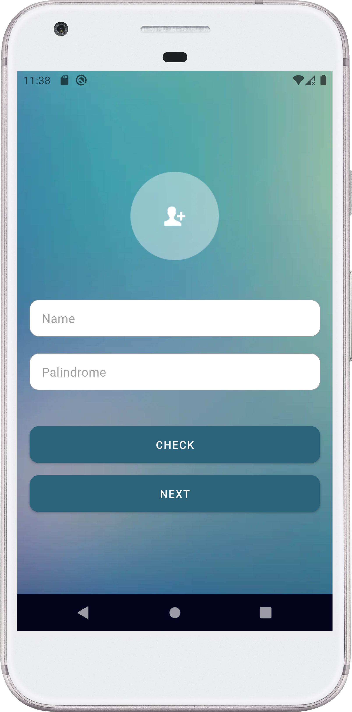
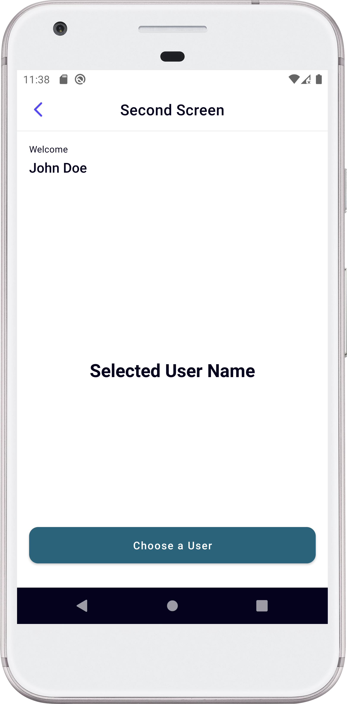
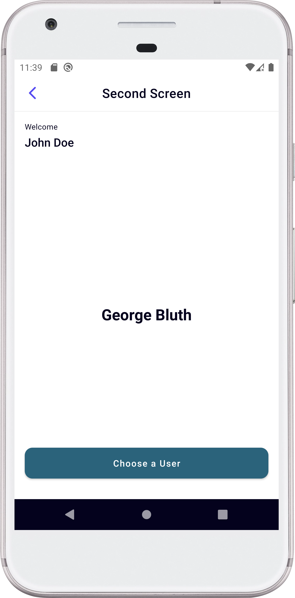
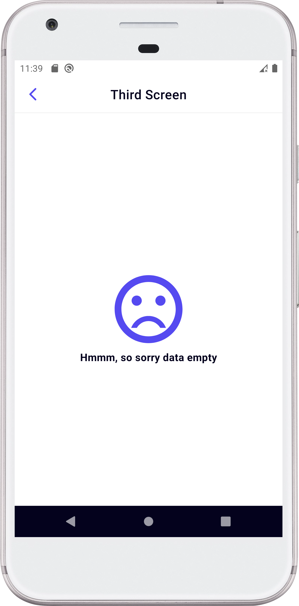
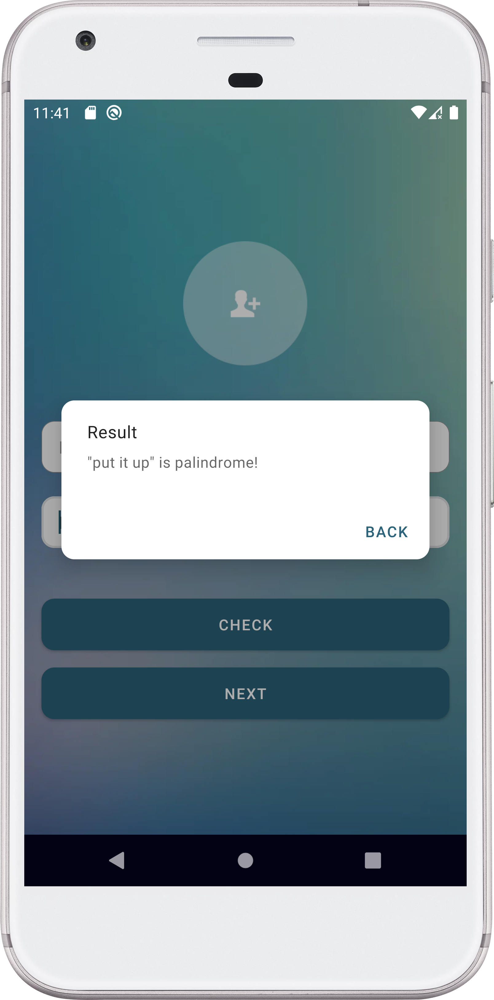
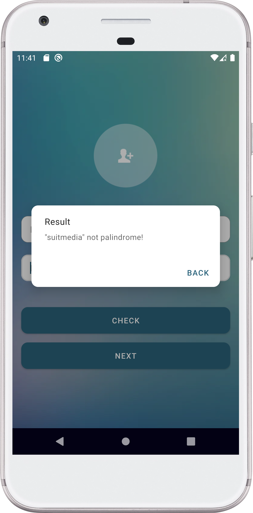

# Test Suitmedia

Technical test for the Suitmedia internship program.

## Installation
### Version Release
  Download file [app-release.apk](https://github.com/rezacahyono/TestSuitmedia/releases/download/v1.0/app-release.apk)
### version Debug
  There are several stages for application installation.
  1. Star this repository.
  2. Cloning this repository to android studio.
  ```git
  git clone https://github.com/rezacahyono/TestSuitmedia.git
  ```

## Techstack
  + Kotlin
  + Livedata
  + Navigation component
  + Paging3
  + Glide image
  + Retrofit

## Screenshot
  |                |                |                |
  |----------------|----------------|----------------|
  ||||
  ||||
  ||||
